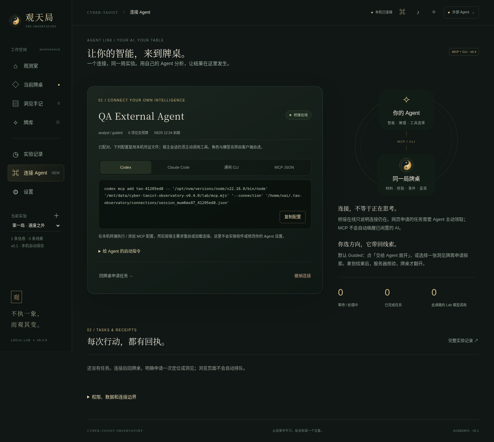

# 观天局 · Cyber-Taoist Observatory v0.4.0

**你的 Agent 提供智能，观天局让分析落在同一张牌桌。**

本机信息分析 / 卡牌实验台：原始材料 → 六象定位 → 五种洞见 → 假说与后续证据。v0.4 在保留分层工作空间和 11 张卡牌的基础上，新增真正的 **外部 Agent 驱动**。



## 运行

Node.js 22.9+，无 npm 运行依赖、无构建、无 CDN 或远程字体。

```bash
npm run lab:start
```

浏览器打开 `http://127.0.0.1:4174/lab`。旧用户先看 [保留数据升级](docs/UPGRADE-v0.4.0.md)，不要覆盖 `.env` 或删除数据。

## 用自己的 AI，而不是再配一套模型

创建/选定实验并导入信息 → 左侧 **连接 Agent** → 保持 **Analyst / Guided** 默认 → 生成凭证 → 复制你的宿主接入配置 → 让宿主加载 MCP。

回牌桌点 **交给 Agent 展开**，再在 Agent 会话中说：

> 领取观天局当前任务，读取真实宪章与 Protocol，用你自己的 AI 分析并提交结果。完成后等我选择下一张洞见牌。

Agent 通过 `get_context → next_task → submit_result` 提交自己的分析；服务端校验后，网页同步展开六象或揭示洞见。**本通路不会调用 Lab 的 LLM endpoint，也不需要向 Lab 提交你 Agent 的 API Key 或登录凭证。**

当前支持 **stdio MCP 桥接和 CLI**。网页自动生成 Codex、Claude Code、MCP JSON、CLI 配置。实际是否需要重新加载，由宿主决定；本版不自动安装或操作宿主。只支持能访问同机服务的 Agent，云端 localhost 不是你的电脑。

**“桥接在线”不是“AI 已唤醒”。**普通 MCP 不会启动闲置的宿主模型。网页排队后需要 Agent 主动领取；最长一次等待 25 秒，不提供未经授权的后台无限循环。用户自己的 Agent 仍按其额度与计费运行。

完整教程：[Agent 接入说明](docs/AGENT-CONNECTION.md) · [协议/API](docs/AGENT-API.md) · [给 Agent 的使用规则](AGENTS.md)

## 同一实验，三种来源清楚区分

| 驱动 | 谁生成结果 | 操作原则 |
|---|---|---|
| 演示 / 模板 | 内置虚构案例或提问模板 | 不调用模型，不冒充理解真实材料 |
| 内置 LLM | `.env` 显式启用的兼容 Chat Completions 接口 | 网页显式选择、分析才调用，可能计费 |
| 外部 Agent | 用户宿主自己的 AI | 先授权连接，再领取任务和提交；Lab 不代调用 |

外部模式保存在本局，刷新不会自动回到付费模型。撤销连接也不会降级执行。需要使用旧模式时，明确切回本机驱动，再选择演示或 LLM。

## 保留的牌桌

观测室是入口；牌桌分 **信息 / 六象定位 / 洞见探索 / 本条手记**，每次专注一个阶段。六象 S/N/R/T/EC/NI 是观察坐标，不强迫未知变成答案。五张洞见牌是裂隙、迁徙、升维、终局、缺席，不靠随机抽牌生成事实。

点击卡牌查看简短判断、逐段依据与未知项。洞见打开独立阅读页，包含替代解释、验证信号与反证条件。人的“有启发 / 已知道 / 太牵强”与后续证据分开记录。

发牌、翻牌、流光、音效、减少动态与窄屏布局保留。浏览、选牌和重放动画不创建任务或调用模型。Agent 接受的结果通过事件同步到同一网页，不模拟鼠标点击。

## 外部结果不是直接信任

- 会话按 run 授权，Guided 默认由人选方向；Autopilot 允许 Agent 在有限预算内自行申请任务。Observer 只读，Operator 另可导入和建空白对照局。
- 默认 8 小时会话、12 项预算；默认 15 分钟领取租约，可续租/释放。撤销、取消或过期的任务拒绝迟到结果。
- 每项任务冻结实际宪章、Protocol、原文、schema、前置定位及哈希。修改输入或规则后不能把旧结果错写到新上下文。
- 六象/洞见共用原逐段引文核验；N 不可标为 OBSERVED。失败结果保留，Agent 修正后重交，最多三次拒绝。不会自动切换模型“救场”。
- 相同幂等键 + 相同内容可安全查询已接受回执，避免重复落牌。变更答案用新键。
- 实验记录有“事件时间线 / 模型调用 / Agent 提交”三栏。协议交付不代表模型遵循；校验通过不等于观点真实。只保留可审查的结构化返回，不要求隐藏思维链。

## 材料导入

支持粘贴文本、TXT、Markdown、JSON、JSONL。每条最多 100,000 字符，文件最多 1 MB，单批最多 100 条。JSON 项使用 `content` 或 `text`，可带 `title`、`source`。

```json
[{"title":"一个观察","content":"这里是完整原文。","source":"出处 / 日期 / URL"}]
```

原文保存后不被分析覆盖。**URL 仅作来源记录，不自动抓取。**图片、PDF 和自动全网采集不在本版。

## 原内置 LLM 仍可用

首次安装可复制 `.env.example`；升级用户保留自己的 `.env`。

```dotenv
TAO_LLM_ENABLED=1
TAO_LLM_URL=https://your-provider.example/v1/chat/completions
TAO_LLM_MODEL=your-model
TAO_LLM_KEY=your-key
TAO_LLM_TIMEOUT_MS=180000
```

重启服务，在设置里明确选择 LLM。endpoint 使用完整地址，不补路径；接口需兼容 messages/choices 的 Chat Completions 形状。`MAPPING_`、`INSIGHT_` 思考/token/超时设置保留，详见 `.env.example` 和 [v0.2.1说明](docs/UPGRADE-v0.2.1.md)。不是原生 Anthropic Messages 适配器；Claude Code 接入则走新 MCP，不受这个限制。

旧模型失败恢复仍可在本机模式中“重新校验旧返回 · 不调用模型”。历史失败 trace 保留，恢复另记事件。伪造/改写引用不会被接受。外部会话的失败使用任务修正流程，不能通过旧 recover 绕过。

## CLI

```bash
node lab/cli.mjs capabilities
node lab/cli.mjs create --title "信息观测"
node lab/cli.mjs ingest RUN_ID --file article.md
node lab/cli.mjs agent help
```

新 MCP 入口：`node lab/mcp.mjs --connection /absolute/private/connection.json`。先配对的完整步骤见接入说明。Web 与 CLI 不各存一套状态。

## 数据和安全

默认数据目录 `.tao-lab`；升级用 `TAO_LAB_HOME` 指定旧目录的绝对路径。只运行一个服务器实例。实验保留 run JSON、原文、协议快照、事件、模型 trace 与新任务/提交记录。浏览器只保存动效偏好，不保存模型密钥或配对令牌。

会话凭证与 claim 文件按私有文件处理。你的材料可能进入自己 Agent 的模型上下文，应符合宿主权限和隐私政策。不要发无权分享的内容。

**这是单用户、受信本机工具，不是隔离沙箱。**监听 loopback 并检查 Host/Origin。Agent API 令牌有角色/范围校验，但同机拥有 shell/文件权限的进程仍可操作旧操作者接口和文件。不提供公网认证、远程隧道或恶意本机 Agent 防护。

## 测试与界限

```bash
npm run lab:check
npm test
# UI 开发测试额外要求 Python Playwright + Chromium
python tests/ui_agent_smoke.py --chromium /path/to/chromium
```

本版实际验证记录：[TEST-REPORT.md](docs/TEST-REPORT.md)。没有使用用户的生产数据，没有使用真实商业模型，也未登录真实 Codex / Claude Code 验证宿主专有行为。固定结果夹具只验证工程链路，不验证理论效用或 AI 洞见质量。

浏览器在本次执行环境的 localhost 访问受策略限制，UI 用渲染桥接检查；原生 HTTP/SSE、MCP stdio 与 CLI 另有实际进程测试。不更改浏览器策略，也不把桥接说成原生浏览器全链路验证。

## 文档与版本

- [升级](docs/UPGRADE-v0.4.0.md)
- [Agent 接入](docs/AGENT-CONNECTION.md)
- [API / MCP profile](docs/AGENT-API.md)
- [变更记录](CHANGELOG.md)
- [宪章](content/CONSTITUTION.md) / [Protocol v0.1](content/PROTOCOL-v0.1.md)

宪章与 Protocol 不在这次升级中修改。这个版本改善的是“谁提供智能、怎样安全提交、怎样在同一张牌桌看见结果”，不是宣称理论已经得到证实。
