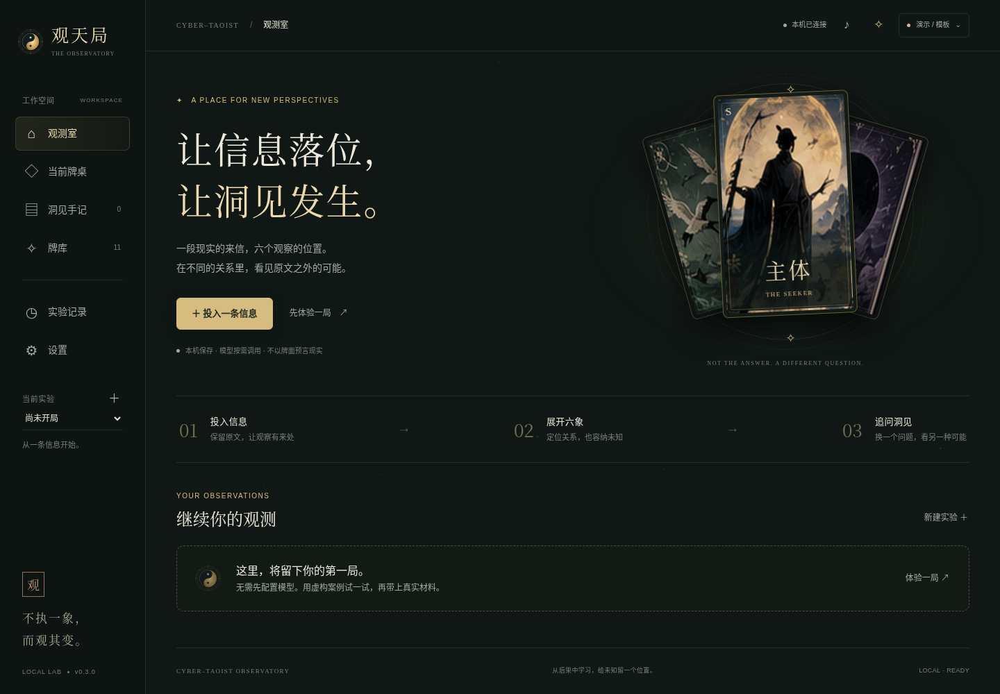
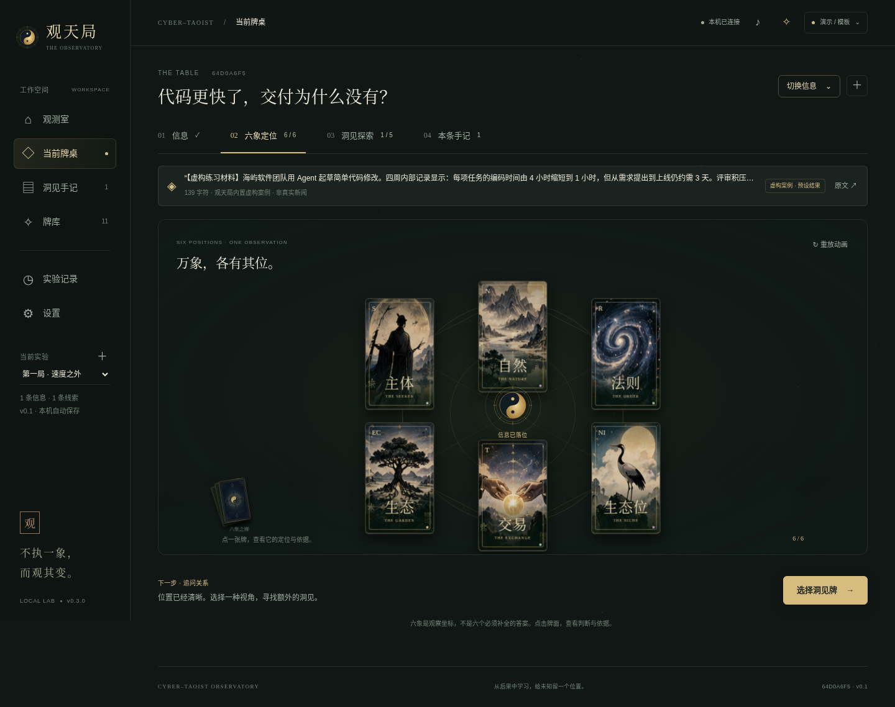

# 观天局 · Cyber-Taoist Observatory v0.3.0

**让信息落位，让洞见发生。** 一个运行在本机的认知卡牌实验台。

v0.3.0 将原来集中在一个长页面的内容，拆成 **观测室 → 分阶段牌桌 → 独立洞见阅读**。不是新皮肤覆盖旧布局：导航、阅读、证据、实验记录和配置都有各自的层级。

**已有 v0.2.1：先看 [保留旧数据的升级步骤](docs/UPGRADE-v0.3.0.md)。不覆盖旧目录、不替换密钥、不删除 `.tao-lab`。**



## 直接运行

要求 Node.js 22.9 或以上。本次测试使用 22.16.0。无 npm 运行依赖、无前端构建、无远程字体或 CDN。

```bash
npm run lab:start
```

打开 `http://127.0.0.1:4174/lab`。在首页点 **“先体验一局”**，不需要 API Key。内置材料与结果均为明确标注的虚构案例，不是模型测试成绩。

## 这一版怎么用

**观测室**：新建实验、粘贴/导入材料，或继续以前的实验。

**当前牌桌**分成四个阶段，同一时刻只显示一个：

| 阶段 | 当前主要任务 |
| --- | --- |
| 01 信息 | 看原文、来源，明确本次要观察什么 |
| 02 六象定位 | 展开六象；点牌查看定位，再翻面看逐段依据 |
| 03 洞见探索 | 选择裂隙 / 迁徙 / 升维 / 终局 / 缺席，再明确点击探索 |
| 04 本条手记 | 回看这条信息产生的所有洞见 |

**洞见阅读**是独立页面，不再塞进长弹窗。先看新增解释与替代解释，再看验证信号、反证条件；原文引文默认折叠。评价“有启发 / 已知道 / 太牵强”，或追加后续证据，原洞见不被覆盖。

**洞见手记**可按当前实验搜索与筛选；**牌库**分六象与洞见两类；**实验记录**在时间线与模型 trace 间切换；**设置**单独成页，高级配置默认折叠。



选牌、浏览、重放动画、切换阶段不调用模型，不改变实验数据。网页和 Agent CLI 仍使用同一个服务端 run。11 张原有插画、翻牌、发牌、流光、音效和减少动态设置保留。

## 接入 LLM

首次使用才复制配置；升级用户应保留自己的 `.env`：

```bash
cp .env.example .env
```

在 `.env` 配置完整的兼容 Chat Completions 接口：

```dotenv
TAO_LLM_ENABLED=1
TAO_LLM_URL=https://your-provider.example/v1/chat/completions
TAO_LLM_MODEL=your-model
TAO_LLM_KEY=your-key
TAO_LLM_TIMEOUT_MS=180000
```

重启本机服务，在网页 **“设置 → 分析方式”** 选择 **LLM 分析**，点击“应用方式”。之后每次明确点击定位或探索才发请求。

- 密钥只从服务端环境读取，不写进浏览器或 run。
- 当前原文、宪章及 Protocol 会发送给你指定的服务商。不要发送未经授权的敏感材料。
- 需要接收 `model/messages` 并返回 `choices[0].message.content` 等兼容形状；不直接支持 Anthropic 原生 Messages 等不同接口。
- 来源 URL 只作记录，不自动抓取网页；也不自动补全 endpoint 路径。
- `MAPPING_` / `INSIGHT_` 的思考、token 上限与超时配置沿用 v0.2.1。详见 `.env.example` 和 [v0.2.1 配置说明](docs/UPGRADE-v0.2.1.md)。
- 刷新页面默认回到演示 / 模板模式，已有真实结果仍显示原来的 provider。再次付费分析需显式选择 LLM。

### 模式不要混淆

| 模式 | 结果来源 | 费用/请求 |
| --- | --- | --- |
| 虚构演示 | 对内置虚构材料编写的预设结果 | 无模型调用 |
| 自有材料 + 模板模式 | 提问模板与 UNKNOWN | 无模型调用，不伪装理解材料 |
| LLM 模式 | 你配置的接口实际返回，并通过校验 | 显式请求；可能计费 |

已有定位、已有单牌洞见会读取复用；强制重算需确认。模型失败不会用模板降级伪装成功。探索全部最多调用五次；中途失败保留前面完成的结果。

## v0.2.1 修复仍然保留

真实的多段引文逐段精确核验。各段在页面中分别展示，明确说明省略和“逐字匹配不等于独立证实”。伪造或改写的引用仍会被拒绝。

失败在牌桌顶部保持可见，区分等待、结构/引文校验、超时、空返回与截断。已保存的完整返回可用 **“重新校验旧返回 · 不调用模型”** 恢复；原失败 trace 不改写，恢复另记事件。重新调用模型必须单独确认。

## 外部材料

支持粘贴、拖入或选择 TXT / Markdown / JSON / JSONL。JSON 支持对象或数组，每项含 `content` 或 `text`：

```json
{"title":"一条观察","content":"原始正文……","source":"来源或 URL"}
```

每次最多 100 条、每条最多 100000 字符、文件最多 1 MB。标题、原文和 hash 保留。页面右上角“切换信息”管理当前实验内的多条材料。文本中的 HTML、脚本和提示词指令只是材料，不执行。

本版不新增自动网络采集、PDF/OCR 或图片导入。

## Agent CLI

终端与浏览器操作同一服务，不直接在客户端编造结果：

```bash
node lab/cli.mjs capabilities
node lab/cli.mjs demo
node lab/cli.mjs create --title "今日信息观测"
node lab/cli.mjs ingest RUN_ID --file article.md --source "来源"
node lab/cli.mjs map RUN_ID OBS_ID
node lab/cli.mjs insight RUN_ID OBS_ID --operator migration
node lab/cli.mjs recover RUN_ID TRACE_ID --observation OBS_ID
node lab/cli.mjs feedback RUN_ID INSIGHT_ID --rating insightful
node lab/cli.mjs evidence RUN_ID HYPOTHESIS_ID --text "新的后果" --stance challenges
node lab/cli.mjs branch RUN_ID
node lab/cli.mjs export RUN_ID --out experiment.json
```

真实请求加 `--allow-live`，服务端也须已启用 LLM：

```bash
node lab/cli.mjs map RUN_ID OBS_ID --allow-live
node lab/cli.mjs insight RUN_ID OBS_ID --operator all --allow-live
```

CLI 的 JSON 输出与错误退出码不变。完整协议见 [AGENTS.md](AGENTS.md)。

## 旧数据与页面恢复

用绝对路径连接已有数据目录：

```dotenv
TAO_LAB_HOME="/absolute/path/to/old-project/.tao-lab"
```

只运行一个服务进程。旧 run 不自动迁移或重算。旧 `/lab?run=RUN_ID` 链接继续有效；新链接可保留信息、阶段与具体手记，刷新不重新调用模型。

本项目只监听 `127.0.0.1`，是单用户本机实验台，不是生产级公网服务。更换端口用 `PORT`，CLI 相应设置 `TAO_LAB_URL`。

## 保持理论与实验条件不变

`content/CONSTITUTION.md`、`content/PROTOCOL-v0.1.md` 与 v0.2.1 逐字相同。模型请求、证据校验、API、存储格式也没有因 UI 升级而变化。`adapterVersion` 和 `validatorVersion` 仍保留其实际实现版本 0.2.1；应用发布版本为 0.3.0。

新 run 捕获理论文本快照；创建对照局复制原文，清空分析与评价。修改一份新的 Protocol 需要先增加对应的真实文件，不接受只有版本名、没有内容的伪对照。

本版没有增加自动深刻度评分、盲评或长期预测验证。游戏体验不等于理论效果已被验证。

## 开发与验证

```bash
npm run lab:check
npm test
```

另外提供可选 UI 回归测试（测试环境需要 Python Playwright 与 Chromium，运行应用本身不需要）：

```bash
python tests/ui_smoke.py
# 浏览器限制 localhost 时，仅用于开发环境的渲染桥接：
python tests/ui_smoke.py --bridge
```

UI 测试自动创建临时数据目录与模拟模型服务，不使用你的旧局和真实密钥。`ui_patch_smoke.py` 是同一套测试的兼容入口，不是另一套独立测试。

具体测试次数、截图和验证边界见 [本版测试报告](docs/TEST-REPORT.md)。本次未用真实商业模型密钥，未在 Safari、Firefox 或实体手机上测试。

## 文件结构

```text
lab/public/index.html     分层页面壳
lab/public/style.css      布局、配色、卡牌与响应式样式
lab/public/app.js         UI、路由与显式动作
lab/public/ui-state.js    纯展示路由和筛选函数
lab/public/effects.js     原有发牌、翻牌、粒子、音效
lab/public/assets/        原有 11 张插画与本机 SVG
lab/server.mjs            原有 API、SSE、存储与模型请求
lab/engine.mjs            原有机制（只更新应用版本）
lab/evidence.mjs          原有引文核验
lab/llm-config.mjs        原有思考/超时配置
lab/cli.mjs               原有 CLI（只更新帮助版本号）
content/                  宪章与 Protocol 原文快照
```

设计说明见 [UI 结构与边界](docs/UI-ARCHITECTURE.md)。全部实际界面由 HTML/CSS 与本机插画渲染，没有把概念图当作可以操作的页面。
