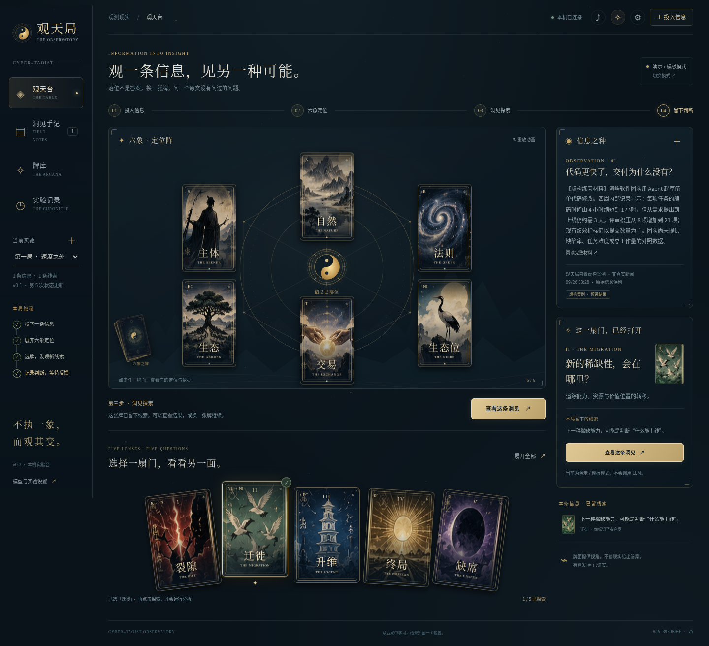
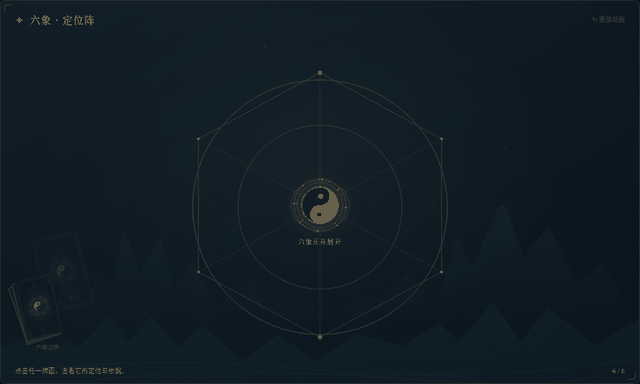

# 观天局 · Cyber-Taoist Observatory v0.2

**把一条信息放上牌桌。六象看位置，五牌问关系，最后留下等待现实检验的线索。**

这是 v0.1 的可运行升级，不是概念图或静态页面。Node.js 本机服务器、网页与 Agent CLI 共用一份实验状态。没有 npm 依赖，也不需要构建。



## 30 秒开始

需要 **Node.js 22.9 或更新版本**（本次验证环境为 22.16.0）。终端进入解压后的项目目录：

```bash
npm run lab:start
```

浏览器打开：

```text
http://127.0.0.1:4174/lab
```

第一次建议点右侧 **「先体验一局」**。这个按钮会创建一个明确标注的虚构案例，不调用 LLM。随后：

1. 看六张定位牌从牌堆展开。点牌查看定位，再点大牌翻到证据面。
2. 在下方选择「裂隙 / 迁徙 / 升维 / 终局 / 缺席」中的一张，再点击「用这张牌探索」。
3. 在洞见详情中查看额外解释、原文依据、替代解释、支持信号和反证条件。
4. 评价「有启发 / 已知道 / 太牵强」，或者给旧假说追加新的支持、挑战材料。

**没有 API Key 也能完整体验玩法。自有材料在模板模式下不会得到真实 LLM 分析。**

## 这一版看得见、操作得到的变化

- **11 张独立牌面**：六象定位牌与五张洞见牌；统一卡背、边框、牌号和中英文标题。
- **动态牌桌**：牌堆交错、错峰发牌、3D 翻牌、悬停透视与流光、选牌抬升、粒子反馈、低强度星尘背景。
- **可选音效**：本机合成的发牌、揭示和记录提示音；默认关闭。顶部可随时关闭音效和动效，并尊重系统“减弱动态效果”设置。
- **一步一个目标**：投入信息 → 六象定位 → 洞见探索 → 留下判断。进程表示完成了哪些操作，不是认知质量分数。
- **翻牌后见依据**：不再把所有术语和说明同时堆在桌面上。
- **洞见手记、11 张牌库、实验时间线**：都是可操作页面，不是占位导航。
- **后续证据**：支持、挑战、未明确三种人工标注；保留旧假说与所有证据，不自动宣称“已证实”。
- **CLI / 网页同步**：SSE 实时通知，辅以读取同步；浏览页面和重放动画不推进实验。

发牌动画的实际录屏：



## 演示、模板、LLM：不要混淆

| 模式 | 信息与结果来自哪里 | 是否调用模型 |
| --- | --- | --- |
| 内置虚构案例 | 虚构输入与针对该输入编写的预设定位、洞见 | 否 |
| 自有材料 + 模板模式 | 仅给通用提问框架和 UNKNOWN；不会伪装理解了材料 | 否 |
| LLM 分析 | 将所选原文、宪章快照和 Protocol 快照发送到配置的接口 | 是，需要显式开启 |

没有随机抽牌来判断未来。牌对应固定分析问题；发牌顺序和视觉特效不改变分析机制。

## 接入 LLM

复制配置文件：

```bash
cp .env.example .env
```

在 `.env` 填写：

```dotenv
TAO_LLM_ENABLED=1
TAO_LLM_URL=https://your-provider.example/v1/chat/completions
TAO_LLM_MODEL=your-model
TAO_LLM_KEY=your-key
TAO_LLM_TIMEOUT_MS=45000
```

重启服务，在网页右上角设置里选择 **LLM 分析**。然后导入信息并明确点击定位或探索。

接口需要兼容 Chat Completions：接收 `model` 和 `messages`，通常返回 `choices[0].message.content`。本版不直接支持 Anthropic 原生 Messages 格式或其他不兼容形状。可以使用兼容网关或本地服务。地址是完整 endpoint，不会自动拼接路径。`temperature` 默认不发送，可按提供方要求设置 `TAO_LLM_TEMPERATURE`。

API Key 只读取本机服务端环境变量，不写进网页、run 或导出记录。**你的原始材料及提示词会发给你指定的提供方**，不要导入未经授权发送的敏感资料。

现有结果不会因切换模式自动重算。在设置里选择“重新定位”可重算当前定位；想干净比较两种方式，使用“创建空白对照局”，或切换到一个新实验。

每次真实定位通常 1 次调用；单张洞见 1 次；已定位后探索全部最多 5 次。CLI 在没有定位时直接探索，会先进行定位。除非传入 `--force`，重复请求已有结果只读复用。

**失败不降级伪装成功**：超时、非 JSON、缺字段、不受原文支持的 OBSERVED 引文会显式报错并记录；已经完成的其他牌保留。模型调用质量与洞见价值需要真实使用反馈，界面不会自行给“深刻程度”打分。

## 外部材料

网页支持粘贴、文件选择和拖入 TXT / Markdown / JSON / JSONL。JSON / JSONL 每项至少含 `content` 或 `text`：

```json
{"title":"一条观察","content":"原始正文……","source":"来源或 URL"}
```

JSON 文件可以是对象或对象数组。每次最多 100 条，每条最多 100000 字符；文件最多 1 MB。原文与其 SHA-256 保留在 run 中。

**来源 URL 只记录，不自动抓取网页。** 当前不处理图片、PDF、OCR、自动互联网采集。

## Agent CLI

CLI 始终请求服务器，不自行编造定位或洞见。人和 Agent 查看同一 `run`。

```bash
node lab/cli.mjs capabilities
node lab/cli.mjs demo
node lab/cli.mjs create --title "今日信息观测"
node lab/cli.mjs ingest RUN_ID --file article.md --source "来源"
node lab/cli.mjs map RUN_ID OBS_ID
node lab/cli.mjs insight RUN_ID OBS_ID --operator migration
node lab/cli.mjs feedback RUN_ID INSIGHT_ID --rating insightful
node lab/cli.mjs evidence RUN_ID HYPOTHESIS_ID --text "新的后果" --stance challenges
node lab/cli.mjs branch RUN_ID
node lab/cli.mjs export RUN_ID --out experiment.json
```

真实调用需要再加 `--allow-live`，且服务端已启用 LLM：

```bash
node lab/cli.mjs map RUN_ID OBS_ID --allow-live
node lab/cli.mjs insight RUN_ID OBS_ID --operator all --allow-live
```

所有成功响应为 JSON；错误为 stderr JSON 和非零退出码。完整说明见 [AGENTS.md](AGENTS.md)。

## 与 v0.1 共存和迁移

先停止旧服务器并备份旧 `.tao-lab`。v0.2 默认把数据保存到本项目根目录的 `.tao-lab/runs/`。需要继续看旧局，可以在 `.env` 设置：

```dotenv
TAO_LAB_HOME=/absolute/path/to/old-project/.tao-lab
```

旧 run 可以读取；老结果不会被新界面自动覆写。它们可能没有 headline、逐项引文、竞争解释或 prompt 快照，界面会显示缺项。

**同一个数据目录只启动一个服务器实例。** 本版是单机单用户实验台，文件存储不是多进程数据库。更换端口可以设置 `PORT=4175`，CLI 相应设置 `TAO_LAB_URL=http://127.0.0.1:4175`。

## 协议与实验纪律

`content/PROTOCOL-v0.1.md` 与上版逐字相同，没有因为视觉升级修改协议。`content/CONSTITUTION.md` 是已核对 Git blob 的 v1.0.1 原文快照，不是升级草案。出处与校验值在 `content/SOURCES.json`。

新建 run 固定宪章与 Protocol 文本及组合 hash。后续改磁盘上的提示词，不会偷偷修改旧 run 的上下文。对照局会复制原始信息，清空定位、洞见和评价，捕获新的真实文本快照。

要测试下一份 Protocol，先添加 `content/PROTOCOL-v0.2.md`，再用 `branch --protocol v0.2`。仅改版本标签而没有对应文件会报错。

本版没有自动盲评、自动统计“认知增量”或长期预言验证；具备的是可记录、可复查、可对照的基础。

## 检查与测试

```bash
npm run lab:check
npm test
```

包含 20 项自动测试，覆盖基础 API、原文保留、完整闭环、幂等复用、并发写入、对照局、CLI、SSE、旧格式和模拟 LLM 的成功/失败路径。另有可选的浏览器交互测试：

```bash
# 需自行安装 Python Playwright 及浏览器；不是运行产品的依赖。
python tests/ui_smoke.py --url http://127.0.0.1:4174
```

测试会新建演示实验，建议对单独的数据目录运行。测试详情与本次验证的限制见 [docs/TEST-REPORT.md](docs/TEST-REPORT.md)。

## 项目结构

```text
lab/server.mjs         本机 API、实时事件、存储、模型适配
lab/engine.mjs         定位结构、演示案例、洞见与证据记录
lab/cli.mjs            Agent CLI
lab/public/app.js      牌桌、牌库、手记与实验界面
lab/public/effects.js  发牌、翻牌、粒子、音效（只负责展示）
lab/public/assets/     11 张牌面、卡背、标记与背景
content/              原文宪章及未改动的 Protocol v0.1
examples/             外部材料格式示例
AGENTS.md             Agent 操作说明
```

全部视觉资源随项目本地提供，没有 CDN、第三方字体下载或前端依赖。当前仅绑定 `127.0.0.1`，不要作为公网服务暴露。
