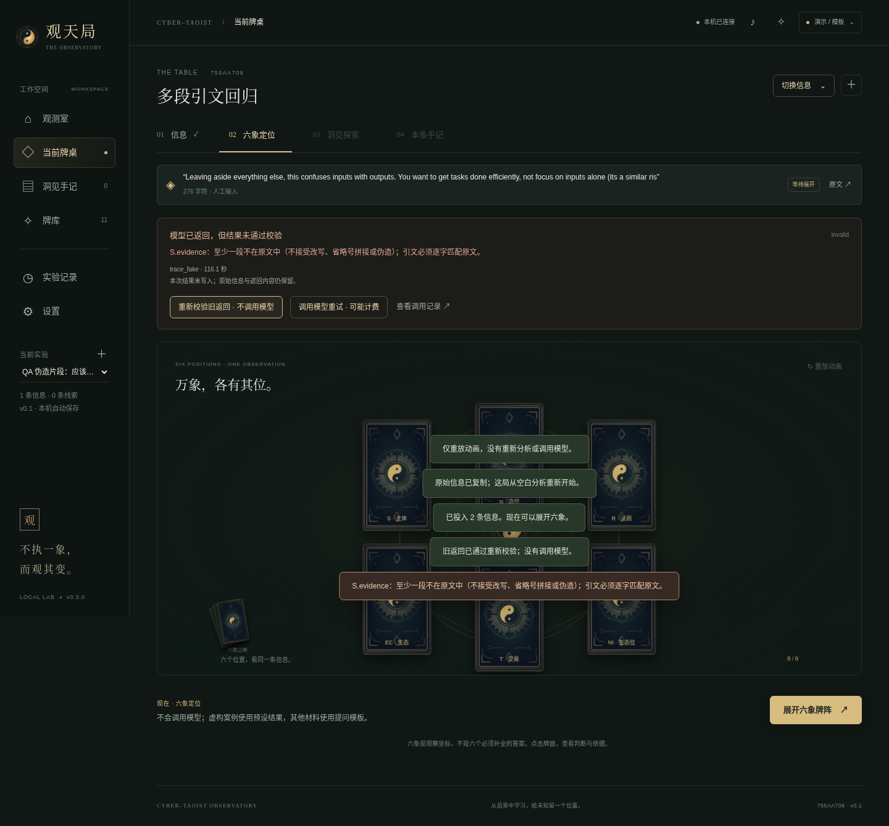
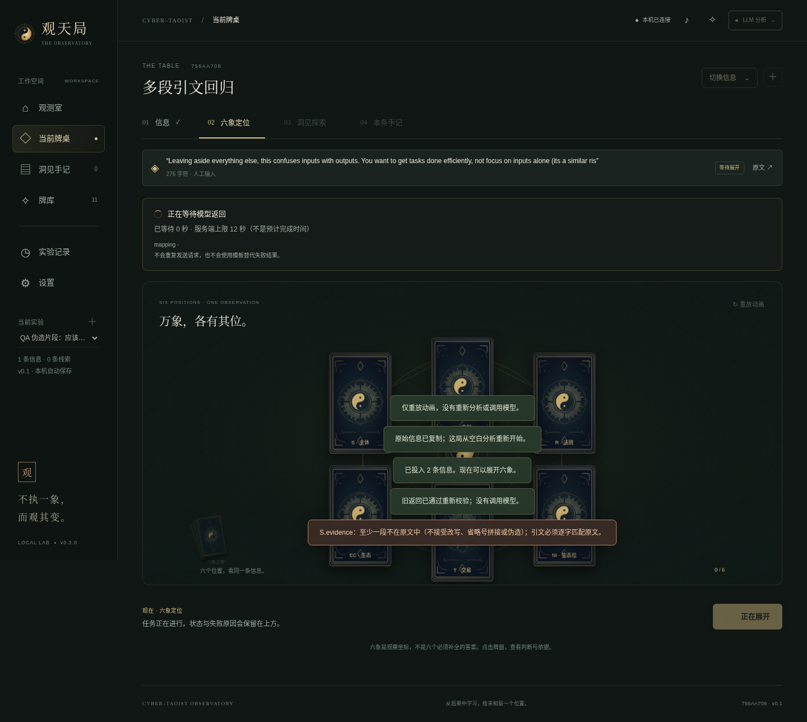

# v0.2.1 补丁验证报告

日期：2026-09-26。运行环境：Linux，Node.js 22.16.0，Python Playwright + Chromium。

## 修复基线与复现范围

代码基线是交付的 `cyber-taoist-observatory-v0.2.zip`。复现依据是《六象展开失败问题报告》中的 276 字符原文、三种被拒引文形状和状态说明。

未收到用户本机的完整 run JSON 与两条完整原始 trace。因此，测试只重现报告给出的原文与引文形状；其余定位文字使用明确标注的测试占位内容。**没有声称已经恢复用户机器上的那一局。**

## 代码、API、CLI：59 项通过，0 失败

执行：

```bash
npm run lab:check
npm test
```

原有 20 项测试继续通过，新增 39 项包括：

- 报告中第一次 R、第二次 S、第二次 R 的分号拼接与引号形状。
- 优先保留原文真实引号，仅在内文逐字匹配时去除成对外层引号。
- 英文/中文分号、换行、CRLF、包含分号的完整原文、不连续引用数组、UTF-16 偏移。
- 大小写、改写、伪造片段、省略号拼接、错误数组、过量片段的拒绝。
- OBSERVED 不允许无依据；N 不允许伪装成直接观测；UNKNOWN 的旧说明不冒充原文引文。
- 洞见与定位共用引用验证；后续牌失败不会丢失已有定位或前一张洞见。
- 请求参数按阶段设置并保留；未配置时不强制 thinking / reasoning_effort / token 上限；非法参数发请求前拒绝。
- 配置 240 秒时不被静默裁为 120 秒。另以 1 秒截止时间实际测试请求中止、错误记录和不自动重试。**未实际等待 240 秒做长时延压测。**
- 兼容旧 trace 的本地恢复、原文绑定、重复恢复幂等、现有结果覆盖保护、CLI JSON 恢复和诊断。
- 恢复失败仅追加新事件，不改历史 trace；带伪造片段的返回仍拒绝。
- 思考内容不保存、不作为最终答案；只记录 usage 中的 token 统计。
- 空最终内容、JSON 非法、HTTP 失败、token 截断分别记录；即便被截断的文本恰好能解析，也不作为完整成功。
- 洞见预检失败不能倒改同一次操作中已经成功的 mapping trace。
- GET、刷新、动画回放不恢复旧结果、不发模型请求。

测试原始输出：`docs/tests.tap`。测试摘要：`docs/VALIDATION-RESULTS.json`。

## 界面：28 项检查通过，0 未捕获 JavaScript 错误

原有 `ui_smoke.py`：16 项，包括牌堆、发牌、翻牌、五牌探索、手记、证据、对照局、CLI 同步、材料转义、减弱动态效果及移动端。

新增 `ui_patch_smoke.py`：12 项，包括旧失败局的持久错误面板、无模型调用的恢复、分段引文正反面、移动端不溢出、伪造片段拒绝、事件查看、计费重试前确认、等待时钟、单次重试成功、洞见引用以及实际参数展示。

```bash
python tests/ui_smoke.py --bridge --url http://127.0.0.1:4174
python tests/ui_patch_smoke.py --bridge
```

补丁 UI 测试会启动临时数据目录与本地模拟模型，结束后清理。模拟模型有固定延迟，便于核对等待时钟和请求数量。

实际错误与恢复入口：



实际等待提示（12 秒上限来自测试配置，不是产品默认值）：



## 浏览器测试限制

环境中的 Chromium 阻止直接导航到 localhost（`ERR_BLOCKED_BY_ADMINISTRATOR`）。未修改浏览器策略。使用已有的渲染桥接测试法：实际 HTML / CSS / JS 在 `about:blank` 中渲染，资源内联，API 请求转发到真实本机 HTTP 服务器。

本次桥接器增加异步请求转发，避免一个长模型请求阻塞其他状态读取。它验证真实后端状态变化与网页轮询回退；**不是原生浏览器 SSE 端到端测试**。真实 SSE 发布与 REST 同一版本由 Node 集成测试独立覆盖。

测试脚本也支持正常环境下的原生导航；原生模式的测试代码只在测试响应里暴露只读状态探针，不改生产模块。此环境没有验证原生导航路径。

## 原文、协议与资源完整性

与 v0.2 ZIP 逐字节比较：`content/CONSTITUTION.md`、`content/PROTOCOL-v0.1.md`、内容来源记录、全部卡牌资源与 `effects.js` 不变。详情与 SHA-256：`docs/content-integrity.json`。

补丁改变的是请求输出契约、引文验证、恢复路径、可选参数和状态显示；新 trace 保存适配器版本、校验器版本、有效请求参数与 requestHash。不能仅凭相同 protocolHash 宣称两次实验设置完全相同。

## 未验证、未声称

- 没有使用真实 DeepSeek 或其他商业模型密钥发起付费调用。配置透传和异常处理由本地模拟 Chat Completions 接口验证，不证明任意第三方网关兼容。
- 没有验证修改思考参数对分析质量的影响，也不保证延迟下降多少。
- 未在原生 macOS / Windows 运行；未进行公网部署或多进程共享数据测试。
- 引文匹配只证明文本存在于输入，不验证来源真实或推断正确。
- 用户本机数据并不在当前环境，恢复操作须在用户保留的 `.tao-lab` 上显式执行。

独立解压启动检查结果见 `docs/VALIDATION-RESULTS.json` 的 `freshExtractSmoke`。

## 独立解压检查：通过

从压缩包重新解压到临时目录，不安装依赖，用 `npm run lab:start` 启动。版本与恢复能力读取正确；CLI 演示、六象定位、五张洞见、导出均成功；在解压目录再次执行 `npm test`，59 项通过。检查使用独立临时数据，不包含用户运行记录。
